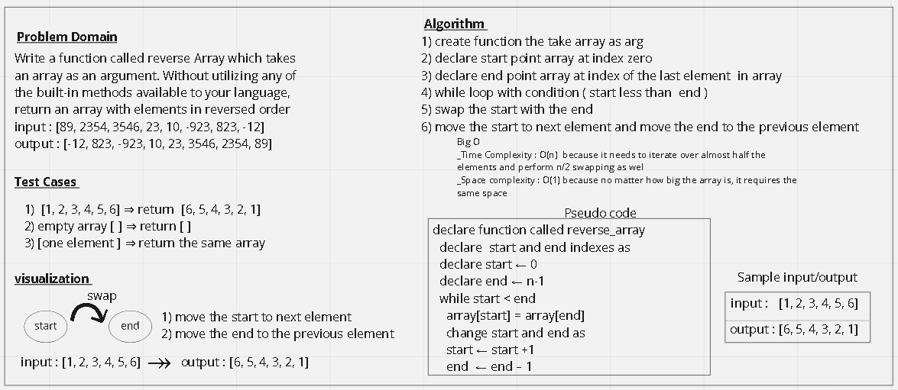

# Reverse an Array
- Description of the challenge 
- Write a function called reverseArray which takes an array as an argument. Without utilizing any of the built-in methods available to your language, return an array with elements in reversed order

## Whiteboard Process

## Approach & Efficiency
- What approach did you take?
  - I used swapping inside while loop to solve this challenge 
- Discuss Why? I build the function form scratch to do the swapping for me 
- What is the Big O space/time for this approach?
   - Big O
      - Time Complexity : O(n)      
      - Space complexity : O(1) 
