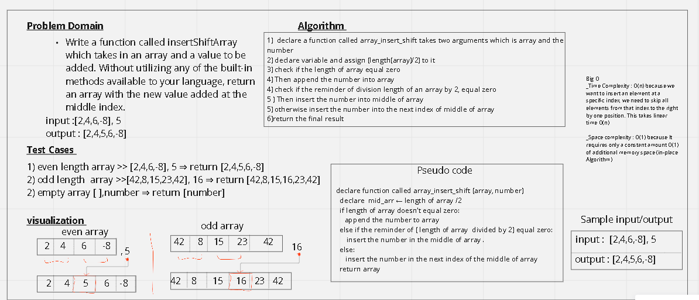

# Insert to Middle of an Array

> Write  a function called insertShiftArray which takes in an array and a value to be added. Without utilizing any of the built-in methods available to your language, return an array with the new value added at the middle index.

## Whiteboard Process
> array_insert_shift Whiteboard

## Approach & Efficiency
 - What approach did you take?
  - I used searching and insertion to solve this challenge 
- Discuss Why? I build the function form scratch to do the search and insertion for me 
- What is the Big O space/time for this approach?
   - Big O
      - Time Complexity : O(n)      
      - Space complexity : O(1)