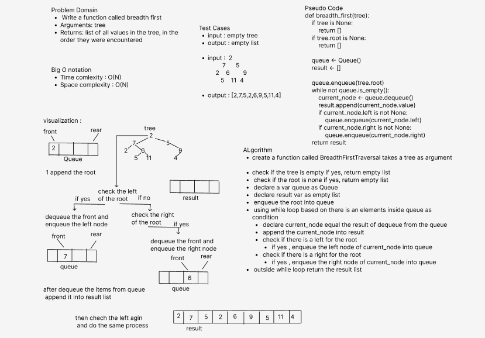

# Challenge Summary
- Write a function called breadth first
  - Arguments: tree
  - Return: list of all values in the tree, in the order they were encountered

    
## Whiteboard Process

 
### Approach & Efficiency
- I used queue and while loop to loop over the tree nodes 
- I used list to return the final result in it 
- Big o Notation
  - Time complexity : O(n)
  - space complexity : O(n)

 
#### Solution
 - create a function called BreadthFirstTraversal takes a tree as argument
 - check if the tree is empty if yes, return empty list
 - check if the root is none if yes, return empty list
 - declare a var queue as Queue
 - declare result var as empty list
 - enqueue the root into queue
 - using while loop based on there is an elements inside queue as condition
   - declare current_node equal the result of dequeue from the queue
   - append the current_node into result
   - check if there is a left for the root 
     - if yes , enqueue the left node of current_node into queue
   - check if there is a right for the root
     - if yes , enqueue the right node of current_node into queue
 - outside while loop return the result list 

##### Tests 
- all tests passed
  - pytest .\tests\test_tree_breadth_first.py