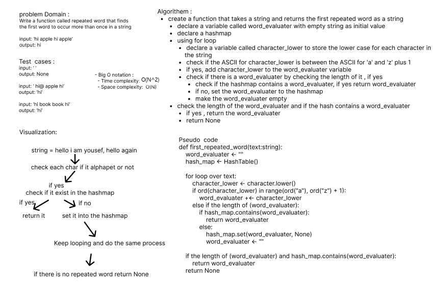

# Code Challenge: Class 31

> Challenge Summary 
- Write a function called repeated word that finds the first word to occur more than once in a string
  - Arguments: string
  - Return: string

> Whiteboard Process

> Approach
- I used hashmap and its functionality to solve this problem 

>  Big O notation 
- Time Complexity: O(N^2) 
  - because i sued nested loop the first in line 13, to iterate over the chars in the string, so it will be o(n)
  - and the second in hte if statement because it is from range to range, so it will be o(n)
  - So the final time complexity will be O(n^2)
- Space Complexity:O(n)

> Solution
- create a function that takes a string and returns the first repeated word as a string
  - declare a variable called word_evaluater with empty string as initial value 
  - declare a hashmap 
  - using for loop 
    - declare a variable called character_lower to store the lower case for each character in the string
    - check if the ASCII for character_lower is between the ASCII for 'a' and 'z' plus 1 
    - if yes, add character_lower to the word_evaluater variable 
    - check if there is a word_evaluater by checking the length of it , if yes 
      - check if the hashmap contains a word_evaluater, if yes return word_evaluater
      - if no, set the word_evaluater to the hashmap 
      - make the word_evaluater empty 
  - check the length of the word_evaluater and if the hash contains a word_evaluater 
    - if yes , return the word_evaluater
  - return None 

> Test 
- `pytest .\tests\test_first_repeated_word.py`
- ALL TESTS PASSED 