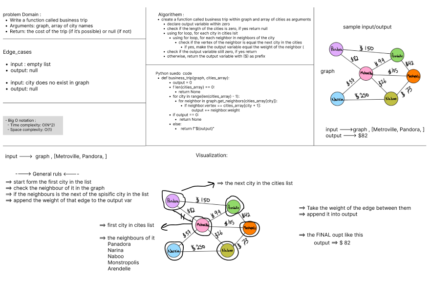

# # Code challenge 37: graph-business-trip

> Challenge
- Write a function called business trip
  - Arguments: graph, array of city names
  - Return: the cost of the trip (if it’s possible) or null (if not)

> Whiteboard Process

> Approach & Efficiency
- Big O Notation for all methods:
  - Time Complexity: O(N^2) Using nested loops 
  - Space Complexity: O(1)

> Testing 
- Run ` pytest .\tests\test_graph_business_trip.py`
- All tests Passed
 

> Solution
- create a function called business trip within graph and array of cities as arguments
- declare output variable within zero 
- check if the length of the cities is zero, if yes return null 
- using for loop, for each city in cities lsit 
  - using for loop, for each neighbor in neighbors of the city
    - check if the vertex of the neighbor is equal the next city in the cities list 
      - if yes, make the output variable equal the weight of the neighbor (incrementally)
- check if the output variable still zero, if yes return null 
- otherwise, return the output variable with ($) as prefix

