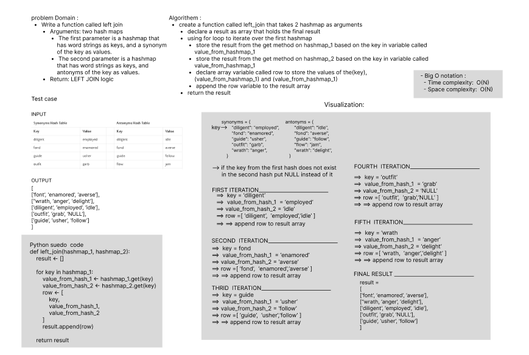

# Code Challenge: Class 33: Hashmap LEFT JOIN 

> Challenge Summary
- Write a function called left join
  - Arguments: two hash maps
    - The first parameter is a hashmap that has word strings as keys, and a synonym of the key as values.
    - The second parameter is a hashmap that has word strings as keys, and antonyms of the key as values.
  - Return: The returned data structure that holds the results is up to you. 
    - It does not need to exactly match the output below, so long as it achieves the LEFT JOIN logic

> Whiteboard Process

> Approach
- I used the array and object as the data structure and for loop to do the job

>  Big O notation 
- Time Complexity: O(N) liner iteration involved. (for loop)
- Space Complexity:O(N) there is an array created in the memory

> Solution
- create a function called left_join that takes 2 hashmap as arguments
  - declare a result as array that holds the final result
  - using for loop to iterate over the first hashmap 
    - store the result from the get method on hashmap_1 based on the key in variable called value_from_hashmap_1 
    - store the result from the get method on hashmap_2 based on the key in variable called value_from_hashmap_1 
    - declare array variable called row to store the values of the(key), (value_from_hashmap_1) and (value_from_hashmap_1)
    - append the row variable to the result array 
  - return the result

> Test 
- `pytest .\tests\test_left_join.py`
- ALL TESTS PASSED