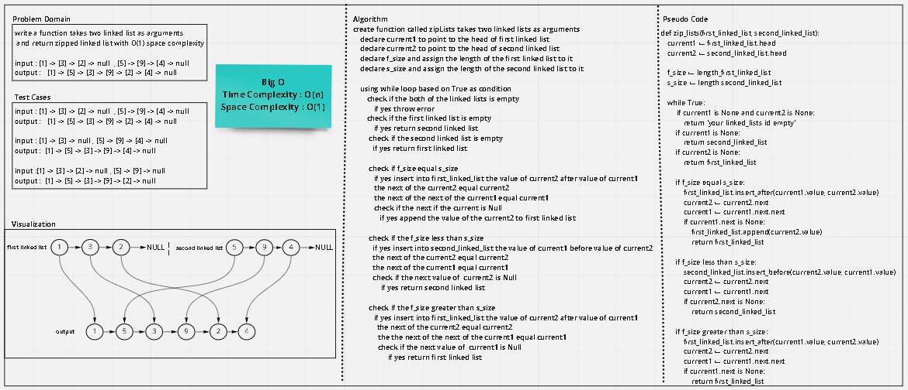

# Code Challenge: Class 08
## Challenge Summary
- write function takes two linked lists as arguments
- return zipped list with O(1) space complexity
- Zip the two linked lists together into one so that the nodes alternate between the two lists and return a reference to the the zipped list.

### Whiteboard Zip_lists

## Approach & Efficiency
- I used while loop to iterate over the both of the linked lists and return zipped list from them
- Big O : 
  - Time complexity : O(n) because while loop 
  - Space complexity : O(1) because I did not book any additional space in the memory

## Solution
- define function takes two linked lists and checks if both are empty, if yes return error msg 
- check if one of them is empty, if yes return the another one 
- get the length of each linked list 

  - check if the size of them is equal 
  - if yes insert into first linked list the value of current2 after the value of current1
  - move the current2 one step and move the current1 two steps 
  - check if the current1 is None append the value of current2 to first linked list
  - return first linked list

  - check if the size of first linked list less than the second linked list 
  - if yes insert into second linked list the value of current1 before the value of current2
  - move the current2 one step and move the current1 one step
  - check if the next of the  current2 is, if yes return second linked list

  - check if the size of first linked list greater than the second linked list 
  - if yes insert into first linked list the value of current2 after the value of current1
  - move the current2 one step and move the current1 two steps
  - check if the next of the current1 is None, if yes return first linked list