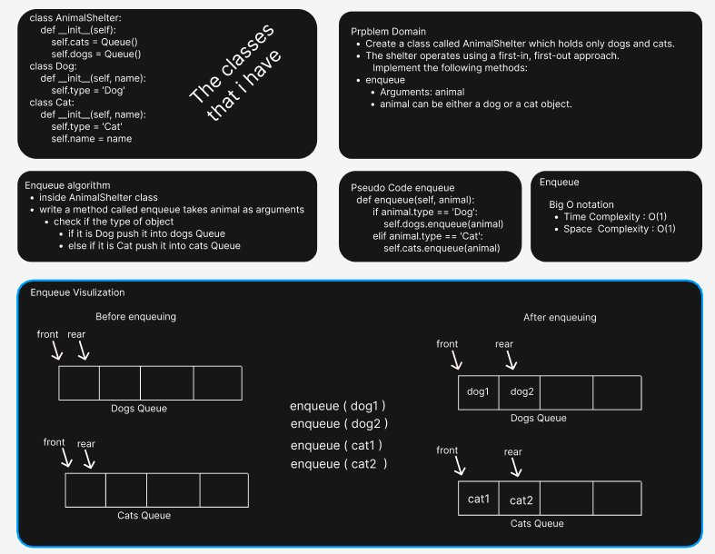
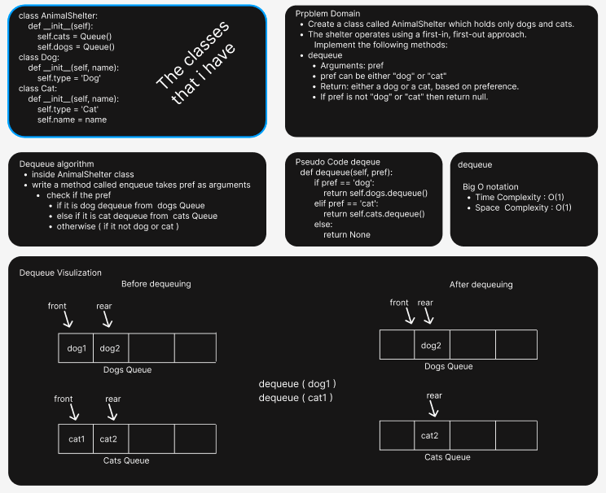

# AnimalShelter
- Create a class called AnimalShelter which holds only dogs and cats.
- The shelter operates using a first-in, first-out approach.
- Implement the following methods:
- enqueue
  - Arguments: animal
  - animal can be either a dog or a cat object.
- dequeue
  - Arguments: pref
  - pref can be either "dog" or "cat"
  - Return: either a dog or a cat, based on preference.
  - If pref is not "dog" or "cat" then return null.

##  Whiteboard Process
* enqueue_whiteboard
  * 

* dequeue_whiteboard
  * 

### Approach & Efficiency
- Big O 
  - Time complexity: O(1)
  - Space complexity: O(1)
- I used two queues 
  - dogs queue to enqueue the dogs objects 
  - cats queue to enqueue the cats objects 
  - enqueue and dequeue methods 

    

#### Solution
- I have 3 Classes 
  - AnimalShelter
    - in the constructor I created two queues 
    - enqueue method 
      - it will take animal type as argument 
      - and check the type of the animal if it is dog enqueue the animal into dogs queue
      - and check the type of the animal if it is cat enqueue the animal into cats queue
    - dequeue method 
      - it will take pref as argument 
      - and check the pref if it is dog dequeue from dogs queue
      - and check the pref if it is cat dequeue from cars queue
      - and if not dog or cat, return None 
  - Dog
    - in the constructor I declared the type of the object as variable
  - Cat
    - in the constructor I declared the type of the object as variable

##### tests
- All test Passed  
- Test Command
  - pytest .\tests\test_stack_queue_animal_shelter.py

