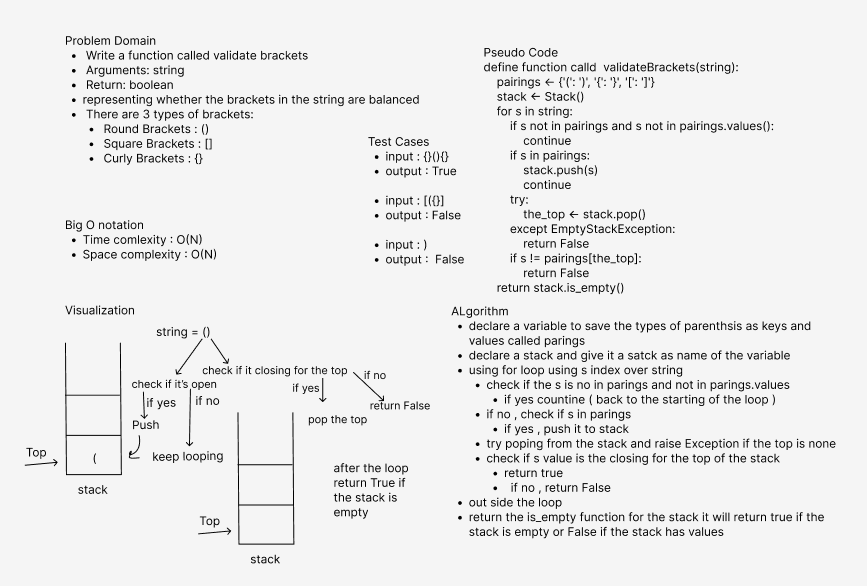

# Challenge Summary
- Write a function called validate brackets
  - Arguments: string
  - Return: boolean
  - representing whether the brackets in the string are balanced
- There are 3 types of brackets:
  - Round Brackets : ()
  - Square Brackets : []
  - Curly Brackets : {}

## Whiteboard Process

### Efficiency
- Big O Notation 
  - Time complexity : O(n) 
  - Space complexity : O(n)

#### Approach & Solution
- I used for loop to iterate over the string and check if the value of index is valid parenthesis
- if yes push it to stack 
- and then check the top value in the stack if it 
- if the top is closing for the open item that I handle, poop it from the stack
- in the final iterate check if the stack is empty,if yes return true, if no return false

##### Test 
- All tests passed successfully
- Test command 
  - pytest .\tests\test_stack_queue_brackets.py
