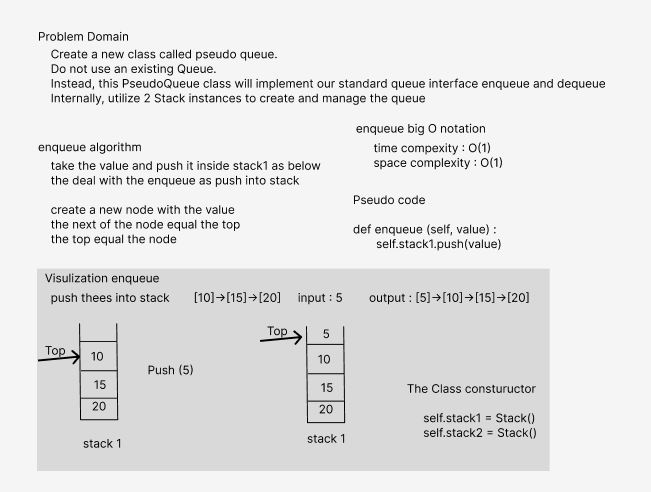
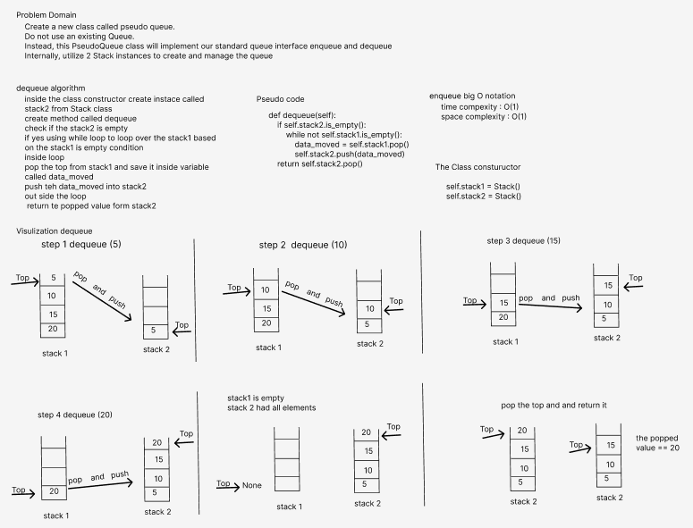

# stack-queue-pseudo
- Create a new class called pseudo queue.
- Do not use an existing Queue.
- Instead, this PseudoQueue class will implement our standard queue interface (the two methods listed below),
- Internally, utilize 2 Stack instances to create and manage the queue
- methods are enqueue and dequeue
## Whiteboard Process

### Approach & Efficiency
- The time complexity of the enqueue is o(1) because it is a normal push
- The time complexity ofteh dequeue is o(n) because i used while loop to move all the elements form stack1 to stack2
#### Solution
- 1 create a constructor in PseudoQueue class and create two instances of Stack type 
- enqueue method : 
  - take the value and push it into stack1 as normal push from the previous code challenge
- dequeue method : 
  - check if the stack2 is empty 
  - if yes using while loop based on stack1 is not empty as condition
    - inside loop 
      - pop the top of stack1 and save it as variable
      - push the variable back into stack2
    - outside loop return the popped value form stack2
##### Test 
- All tests passed 
- pytest .\tests\test_stack_queue_pseudo.py

