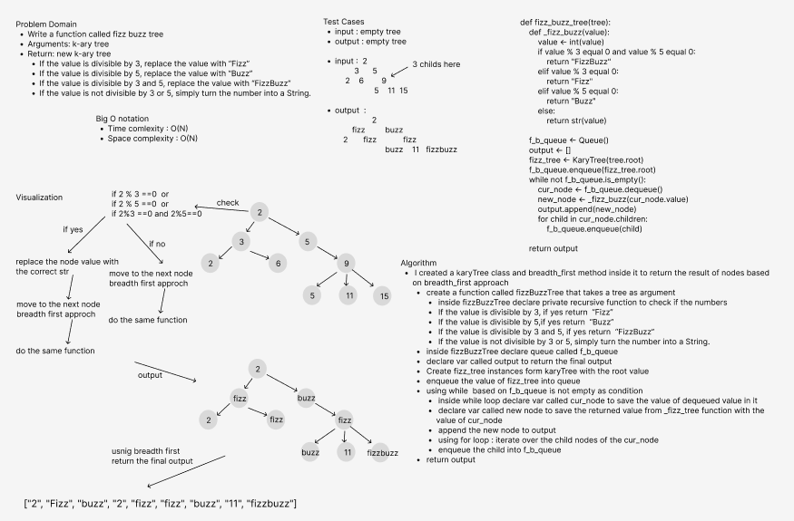

# Challenge Summary
- Write a function called fizz buzz tree
- Arguments: k-ary tree
- Return: new k-ary tre
  - If the value is divisible by 3, replace the value with “Fizz”
  - If the value is divisible by 5, replace the value with “Buzz”
  - If the value is divisible by 3 and 5, replace the value with “FizzBuzz”
  - If the value is not divisible by 3 or 5, simply turn the number into a String.

## Whiteboard Process

### Efficiency
- Big O notation :
  - time complexity : O(N)
  - space complexity : O(N)

#### Approach & Solution
- I created a karyTree class and breadth_first method inside it to return the result of nodes based on breadth_first approach
  - create a function called fizzBuzzTree that takes a tree as argument 
    - inside fizzBuzzTree declare private recursive function to check if the numbers 
      - If the value is divisible by 3, if yes return  “Fizz”
      - If the value is divisible by 5,if yes return  “Buzz”
      - If the value is divisible by 3 and 5, if yes return  “FizzBuzz”
      - If the value is not divisible by 3 or 5, simply turn the number into a String.
  - inside fizzBuzzTree declare queue called f_b_queue
  - declare var called output to return the final output
  - Create fizz_tree instances form karyTree with the root value 
  - enqueue the value of fizz_tree into queue
  - using while  based on f_b_queue is not empty as condition
    - inside while loop declare var called cur_node to save the value of dequeued value in it 
    - declare var called new node to save the returned value from _fizz_tree function with the value of cur_node 
    - append the new node to output
    - using for loop : iterate over the child nodes of the cur_node
      - enqueue the child into f_b_queue
  - return output

##### TEST
- all tests passed
  -  pytest .\tests\test_tree_fizz_buzz.py