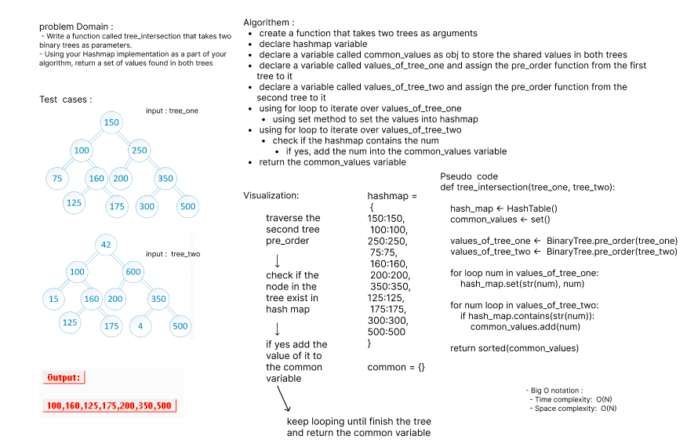

# Code Challenge: Class 32

> Challenge Summary
- Write a function called tree_intersection that takes two binary trees as parameters.
- Using your Hashmap implementation as a part of your algorithm, return a set of values found in both trees.

> Whiteboard Process

> Approach
- I used hashmap and Binarytree to solve this problem 

>  Big O notation 
- Time Complexity: O(N)
  - because I sued 2 separated for loops
  - the time complexity for the methods contains and set is O(1) so it does not matter 
- Space Complexity:O(N)

> Solution
- create a function that takes two trees as arguments 
  - declare hashmap variable 
  - declare a variable called common_values as obj to store the shared values in both trees 
  - declare a variable called values_of_tree_one and assign the pre_order function from the first tree to it 
  - declare a variable called values_of_tree_two and assign the pre_order function from the second tree to it
  - using for loop to iterate over values_of_tree_one 
    - using set method to set the values into hashmap 
  - using for loop to iterate over values_of_tree_two 
    - check if the hashmap contains the num 
      - if yes, add the num into the common_values variable
  - return the common_values variable

> Test 
- `pytest .\tests\test_tree_intersection.py`
- ALL TESTS PASSED