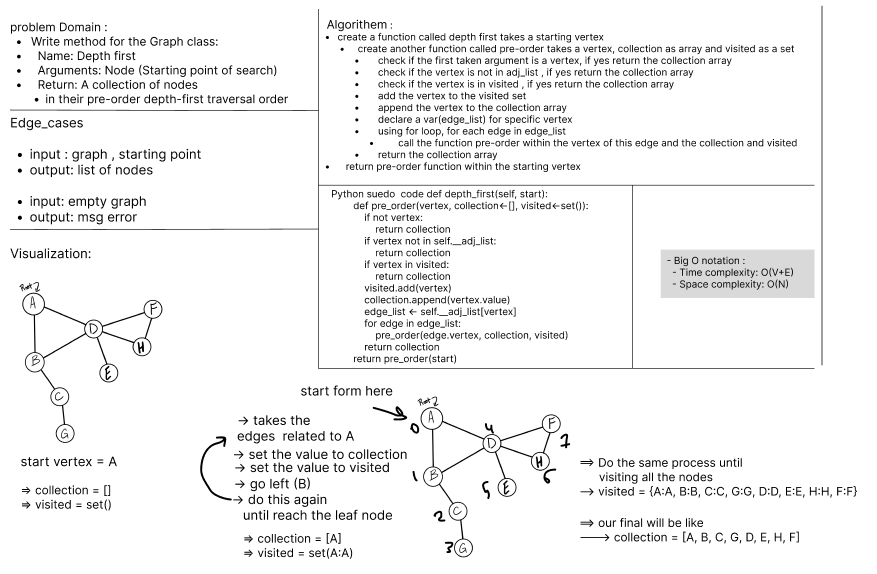

# Code challenge 38: Implement a depth-first traversal on a graph.  

> Challenge
- Write the following method for the Graph class:
  - Name: Depth first
    - Arguments: Node (Starting point of search)
    - Return: A collection of nodes in their pre-order depth-first traversal order
  - Program output: Display the collection

> Whiteboard Process

> Approach & Efficiency
- Big O Notation :
  - Time Complexity: O(V+E) 
  - Space Complexity: O(N)  

> Testing 
- Run `pytest .\tests\test_depth_first.py`
- All tests passed successfully 
 

> Solution
- create a function called depth first takes a starting vertex 
  - create another function called pre-order takes a vertex, collection as array and visited as a set 
    - check if the first taken argument is a vertex, if yes return the collection array 
    - check if the vertex is not in adj_list , if yes return the collection array 
    - check if the vertex is in visited , if yes return the collection array
    - add the vertex to the visited set 
    - append the vertex to the collection array 
    - declare a var(edge_list) for specific vertex 
    - using for loop, for each edge in edge_list 
      - call the function pre-order within the vertex of this edge and the collection and visited 
    - return the collection array 
  - return pre-order function within the starting vertex