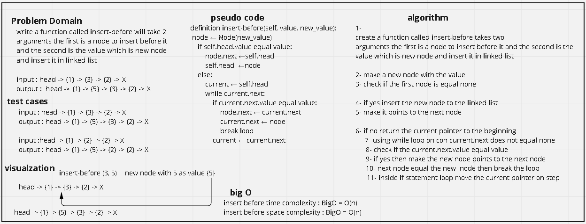
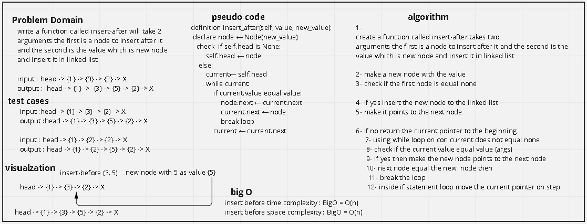
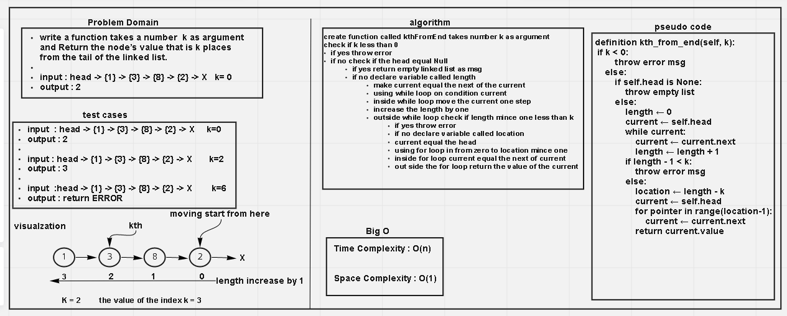

> ### Singly Linked List
A Linked List is a data structure represent the data as nodes each node contain
 - The value 
 - The pointer to the next node 

> #### Challenge
 - Create a Node class that has properties for the value stored in the Node, and a pointer to the next Node.
 - Create a Linked List class
 - create these methods in the linked list 
   - insert
     - Arguments: value
     - Returns: nothing
       - Adds a new node with that value to the head of the list with an O(1) Time performance. 
   - includes
     - Arguments: value
     - Returns: Boolean
       - Indicates whether that value exists as a Node’s value somewhere within the list.
   - to string
     - Arguments: none
     - Returns: a string representing all the values in the Linked List, formatted as:
       - "{ a } -> { b } -> { c } -> NULL"
  
**New code challenge** 
   - append
     - arguments: new value
     - adds a new node with the given value to the end of the list
   - insert before
     - arguments: value, new value
     - adds a new node with the given new value immediately before the first node that has the value specified
   - insert after
     - arguments: value, new value
     - adds a new node with the given new value immediately after the first node that has the value specified
   - kth_from_end:
     - argument: k as number
     - return : the node’s value that is k places from the tail of the linked list.
**New code challenge**  

## Whiteboard Process
- append function

- insert before function

- insert after function

- kth_from_end method

> ##### Approach & Efficiency
 - What approach did you take? why? 
    - Single Linked List
 - What is the Big O space/time for this approach?
 - insertion time complexity : BigO = O(1)
   - insertion space complexity : BigO = O(1)
 - includes time complexity : BigO = O(n)
   - includes space complexity : BigO = O(1)
 - to_string time complexity : BigO = O(n)
   - to_string space complexity : BigO = O(1)
 - insert_before time complexity : BigO = O(n)
   - insert_before space complexity : BigO = O(1)
 - insert_after time complexity : BigO = O(n)
   - insert_after space complexity : BigO = O(1)
 - append time complexity : BigO = O(n)
    - append space complexity : BigO = O(1)
 - kth_from_end time complexity : BigO = O(n)
      - kth_from_end space complexity : BigO = O(1)

> ##### API 
    - Insert
        - it is a method take a value as a parameter and make a new node with the 
          same value, then inert the new node into linkedList 
    - Include
        - it is a method take a value as a parameter and search for it in the 
          linkedList and return True if the value exist in the linked list, if not 
          return False 
    - to_string
        - it is a method to represent the collection of the values inside linkedList
          and return it in a spicific foramtted way 
    - insert before 
        it is a method will take tow arguments the first argument is the node to insert berfore it and the second argument is the new node 
        head -> {1} -> {3} -> {2} -> X	
        insert_before(3, 5)
        head -> {1} -> {5} -> {3} -> {2} -> X
    - insert after
        it is a method will take tow arguments the first argument is the node to insert after it and the second argument is the new node 
        head -> {1} -> {3} -> {2} -> X	
        insert_before(3, 5)
        head -> {1} -> {3} -> {5} -> {2} -> X
    - append
        it is a method take one argument (new node) append new node at theend of linked list 
        head -> {1} -> {3} -> {2} -> X	
        append(5)	
        head -> {1} -> {3} -> {2} -> {5} -> X
    - kth_from_end
        it is an method take one argument k as number and return the node’s value that is k places from the tail of the linked list.
        head -> {1} -> {3} -> {8} -> {2} -> X     k=0 
        return 2
