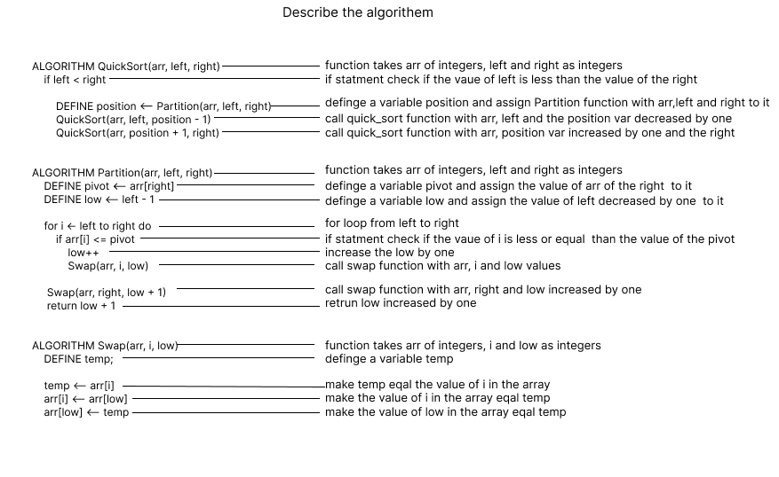

> Visual
- Review the pseudocode below,
- then trace the algorithm by stepping through the process with the provided sample array.

> Tracing Step By Step

> Big O notation 
- Time Complexity: O(N^2)
- Space complexity: O(N)