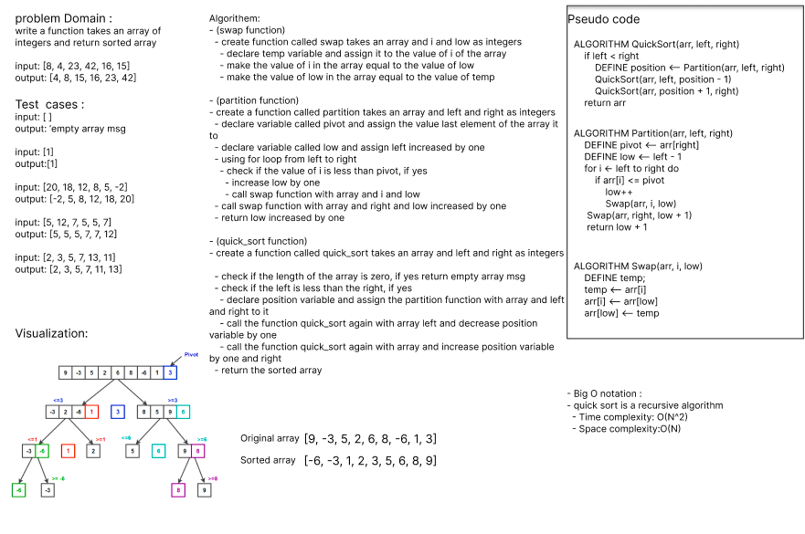

> Challenge Summary
- write a function takes an array of integers and return sorted array

> Whiteboard Process

 

> Approach
- quick sort algorithm 

> Efficiency
- Big O notation : 
- quick sort is a recursive algorithm
  - Time complexity: O(N^2)
  - Space complexity:O(N)

> Solution
- (swap function) 
  - create function called swap takes an array and i and low as integers
    - declare temp variable and assign it to the value of i of the array 
    - make the value of i in the array equal to the value of low 
    - make the value of low in the array equal to the value of temp

- (partition function)
- create a function called partition takes an array and left and right as integers
  - declare variable called pivot and assign the value last element of the array it to
  - declare variable called low and assign left increased by one 
  - using for loop from left to right 
    - check if the value of i is less than pivot, if yes 
      - increase low by one 
      - call swap function with array and i and low 
  - call swap function with array and right and low increased by one 
  - return low increased by one

- (quick_sort function)
- create a function called quick_sort takes an array and left and right as integers 
  - check if the length of the array is zero, if yes return empty array msg 
  - check if the left is less than the right, if yes 
    - declare position variable and assign the partition function with array and left and right to it
    - call the function quick_sort again with array left and decrease position variable by one 
    - call the function quick_sort again with array and increase position variable by one and right
  - return the sorted array

> TEST
- all tests passed
  - pytest .\tests\test_quick_sort.py
    