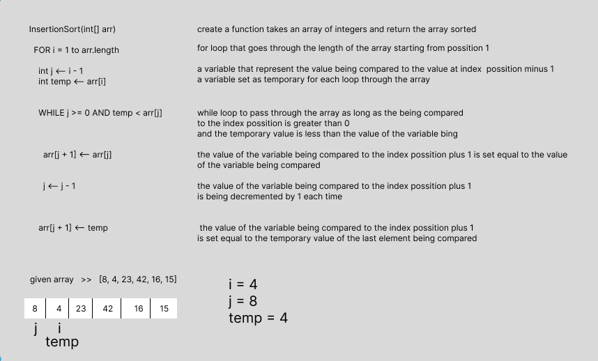

> Visual 
- description of each line of code in the pseudocode with sample Visualization 

> Trace/Step-through
- the original array `[8, 4, 23, 42, 16, 15]`

- 1st pass
  - Start on the left side of the array and check the value at index position 1 (i), which is 4.
  4 is temporarily removed from the array and assigned to the "temp" variable.
  The value of 4 is compared to the value to the left of it, which is 8 (j). Since 4 is less than 8,
  we shift 8 to the right into the vacant position 4 was in since it was temporarily removed.
  4 is now placed in the vacant position 8 was in so that the array will be  `[4, 8, 23, 42, 16, 15]` do the same until break teh while loop

- 2nd pass 
  - Start at the second index position, which is 23 (j + 1), and temporarily removed from the array and assigned to the "temp" variable.
  The value of 23 is compared to the value to the left of it, which is 8 (j). Since 8 is less than 23, it is not shifted to the right in the vacant position 23 was in.
  23 is placed back into it's vacant position so that the array will be `[4, 8, 23, 42, 16, 15]` do the same until break teh while loop

- 3rd pass
  - Start at the third index position, which is 42 (j + 1), and temporarily removed from the array and assigned to the "temp" variable.
  The value of 42 is compared to the value to the left of it, which is 23 (j). Since 23 is less than 42, it is not shifted to the right in the vacant position 23 was in.
  42 is placed back into it's vacant position so that the array will be `[4, 8, 23, 42, 16, 15]` do the same until break teh while loop

- 4th pass
  - Start at the fourth index position, which is 16 (j + 1), and temporarily removed from the array and assigned to the "temp" variable.
  The value of 16 is compared to the value to the left of it, which is 42 (j). Since 16 is less than 42,
  we shift 16 to the right into the vacant position 42 was in since it was temporarily removed.
  16 is now placed in the vacant position 42 was in so that the array will be `[4, 8, 16, 23, 42, 15]` do the same until break teh while loop

- 5th pass
  - Start at the fifth index position, which is 15 (j + 1), and temporarily removed from the array and assigned to the "temp" variable.
  The value of 15 is compared to the value to the left of it, which is 42 (j). Since 15 is less than 42,
  we shift 42 to the right into the vacant position 15 was in since it was temporarily removed.
  15 is now placed in the vacant position 42 was in so that the array will be `[4, 8, 15, 16, 23, 42]` do the same until break teh while loop

- Do the same algorithm to get the sorted array

> Big O Efficiency
- Big O notation : 
  - Time complexity: O(N^2)
    - The basic operation of this algorithm is comparison.
    - This will happen n * (n-1) number of times which is n^2 
  - Space complexity:O(1)
    - No additional space is being created. This array is being sorted in place…keeping the space at constant O(1).