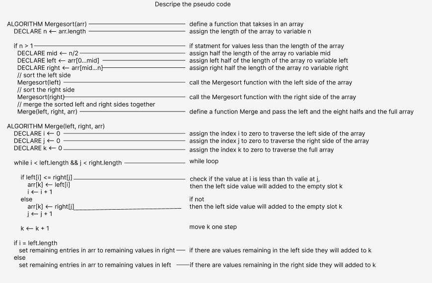

> Visual 
- Review the pseudocode below,
- then trace the algorithm by stepping through the process with the provided sample array.

> Trace/Step-through 

- We will start our function by divide the array into two sub arrays ( left and right) based on the mid variable 
- then we have two subarray we will do the same for the left side and the right side 
- we will do tha same until we have the array as individual elements
- then we will start comparing between the elements on the left side and put the elements on the correct place 
- and we will do the same for the right side 
- after we have the elements in the correct order we will merge it to get the final result (The sorted array )

> BigO notation:
- because we used the recursive way
- Time complexity : O(N*logN)
- Space complexity : O(N)