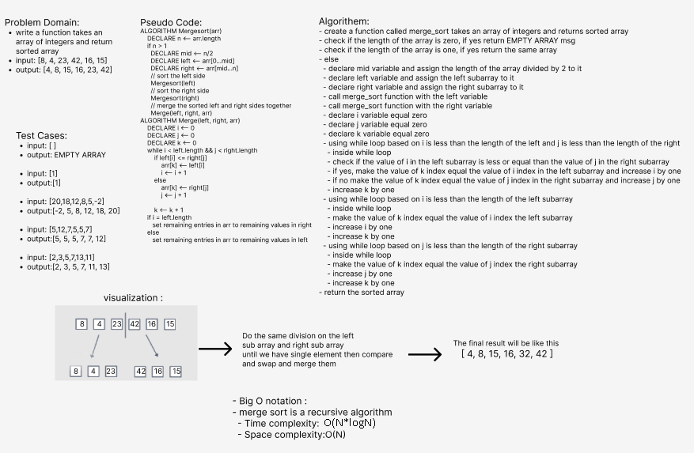

> Challenge Summary
- write a function takes an array of integers and return sorted array

> Whiteboard Process

 

> Approach
- merge sort algorithm 

> Efficiency
- Big O notation : 
- merge sort is a recursive algorithm
  - Time complexity: O(N*logN )
  - Space complexity:O(N)

> Solution
- create a function called merge_sort takes an array of integers and returns sorted array 
- check if the length of the array is zero, if yes return EMPTY ARRAY msg 
- check if the length of the array is one, if yes return the same array 
- else 
  - declare mid variable and assign the length of the array divided by 2 to it 
  - declare left variable and assign the left subarray to it 
  - declare right variable and assign the right subarray to it 
  - call merge_sort function with the left variable 
  - call merge_sort function with the right variable
  - declare i variable equal zero 
  - declare j variable equal zero
  - declare k variable equal zero 
  - using while loop based on i is less than the length of the left and j is less than the length of the right
    - inside while loop 
    - check if the value of i in the left subarray is less or equal than the value of j in the right subarray
    - if yes, make the value of k index equal the value of i index in the left subarray and increase i by one 
    - if no make the value of k index equal the value of j index in the right subarray and increase j by one 
    - increase k by one 
  - using while loop based on i is less than the length of the left subarray 
    - inside while loop
    - make the value of k index equal the value of i index the left subarray 
    - increase i by one
    - increase k by one
  - using while loop based on j is less than the length of the right subarray 
    - inside while loop
    - make the value of k index equal the value of j index the right subarray 
    - increase j by one
    - increase k by one
- return the sorted array 

> TEST
- all tests passed
  - pytest .\tests\test_merge_sort.py
    